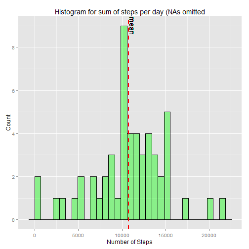
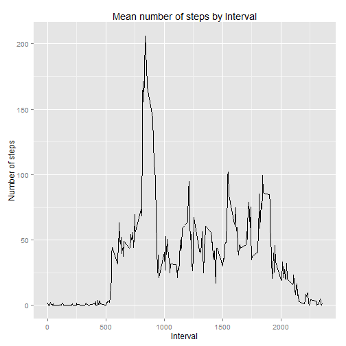
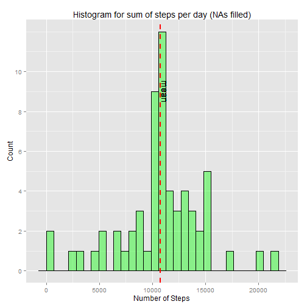
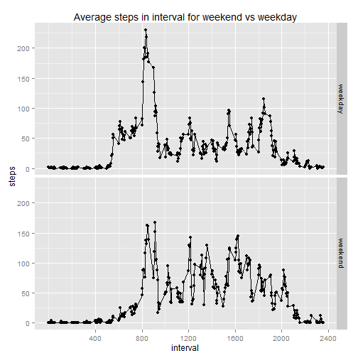

## Loading and preprocessing the data
###First Load libraries, unzip and load data, then clean out the NA(s)

```r
library(ggplot2)
library(grid)
library(gridExtra)

filename <- "activity.zip"
datafilename <- "activity.csv"

activityData <- read.csv(unz(filename,datafilename),header=T)
activityData$steps <- as.numeric(activityData$steps)
activityData$interval <- as.numeric(activityData$interval)
activityData$date <- as.Date(activityData$date)

#get clean set of data
completeCaseActivity <- activityData[complete.cases(activityData),]
```


## What is mean total number of steps taken per day?

```r
dailyStepSum <- aggregate(completeCaseActivity$steps,list(date = completeCaseActivity$date),sum)


print(mean(dailyStepSum$x))
```

```
## [1] 10766.19
```

## What is the median number of steps taken per day?

```r
print(median(dailyStepSum$x))
```

```
## [1] 10765
```

## Histogram of daily activity

```r
dailySumGraph=ggplot(data=dailyStepSum, aes(dailyStepSum$x)) + 
    geom_histogram( 
        col="black", 
        fill="green", 
        alpha = .4) + 
    labs(title="Histogram for sum of steps per day (NAs omitted") +
    labs(x="Number of Steps", y="Count") +
    ylim(c(0,10))+
    scale_y_continuous(breaks=c(0,2,4,6,8,10))+
    geom_vline(aes(xintercept=mean(dailyStepSum$x)),  
               color="red", linetype="dashed", size=1) +
    geom_text(aes(mean(dailyStepSum$x)+500,9,label = "mean"),angle=270)
```

```
## Scale for 'y' is already present. Adding another scale for 'y', which will replace the existing scale.
```

```r
print(dailySumGraph)
```

```
## stat_bin: binwidth defaulted to range/30. Use 'binwidth = x' to adjust this.
```

 

## What is the average daily activity pattern?


```r
fiveMinMean <- aggregate (completeCaseActivity$steps,list(interval=completeCaseActivity$interval),mean)
names(fiveMinMean) <- c("interval","steps")

fiveMinMeanGraph = ggplot(fiveMinMean, aes(x = interval, y = steps)) + 
    geom_line(color = "black") + 
    labs(title = "Mean number of steps by Interval", x = "Interval", y = "Number of steps")
print(fiveMinMeanGraph)
```

 

###Max steps at:


```r
#find interval with the max number of steps
maxSteps <- which.max(fiveMinMean$steps)
print(fiveMinMean[maxSteps, ])
```

```
##     interval    steps
## 104      835 206.1698
```

## Imputing missing values

### Total number of missing values:

```r
## Get index of NAs
missingList <- which(is.na(activityData$steps))
print(length(missingList))
```

```
## [1] 2304
```

### Assign rounded average values for NA(s)

```r
completedData <- activityData
```

### Replace missing values 

```r
for(i in missingList) {
    completedData$steps[i] <- round(fiveMinMean[which(fiveMinMean$interval == completedData[i, "interval"]), "steps"])
    }
```

### Histogram of daily steps with NA(s) replaced

```r
#### Histogram with NAs FILLED
#get sum of daily steps for histogram
dailyStepSum <- aggregate(completedData$steps,list(date = completedData$date),sum)

dailySumFilledGraph=ggplot(data=dailyStepSum, aes(dailyStepSum$x)) + 
    geom_histogram( 
        col="black", 
        fill="green", 
        alpha = .4) + 
    labs(title="Histogram for sum of steps per day (NAs filled)") +
    labs(x="Number of Steps", y="Count") +
    ylim(c(0,10))+
    scale_y_continuous(breaks=c(0,2,4,6,8,10))+
    geom_vline(aes(xintercept=mean(dailyStepSum$x)),  
               color="red", linetype="dashed", size=1) +
    geom_text(aes(mean(dailyStepSum$x)+500,9,label = "mean"),angle=270)
```

```
## Scale for 'y' is already present. Adding another scale for 'y', which will replace the existing scale.
```

```r
print(dailySumFilledGraph)
```

```
## stat_bin: binwidth defaulted to range/30. Use 'binwidth = x' to adjust this.
```

 

####Mean of daily activity with NA(s) replaced

```r
print(mean(dailyStepSum$x))
```

```
## [1] 10765.64
```

####Median of daily activity with NA(s) replaced

```r
print(median(dailyStepSum$x))
```

```
## [1] 10762
```


## Are there differences in activity patterns between weekdays and weekends?
### Primarily the difference is in a later start time for activities, and less well defined activity spikes at specific times


```r
completedData[as.POSIXlt(completedData$date)$wday %in% c(0,6),"dayType"]="weekend"
completedData[as.POSIXlt(completedData$date)$wday %in% c(1,2,3,4,5),"dayType"]="weekday"
completedData$dayType <- as.factor(completedData$dayType)


completedDataByInterval <- aggregate(completedData$steps,
                                     by = list(completedData$interval, completedData$dayType),
                                     FUN = mean)

## Name columns
names(completedDataByInterval) <- c("interval","dayType","steps")

g<-ggplot(completedDataByInterval,aes(interval,steps))
p<-g+geom_line()+geom_point()+facet_grid(dayType~.)
p<-p+labs(title="Average steps in interval for weekend vs weekday")
p<-p+scale_x_continuous(breaks=c(400,800,1200,1600,2000,2400))
print(p)
```

 
